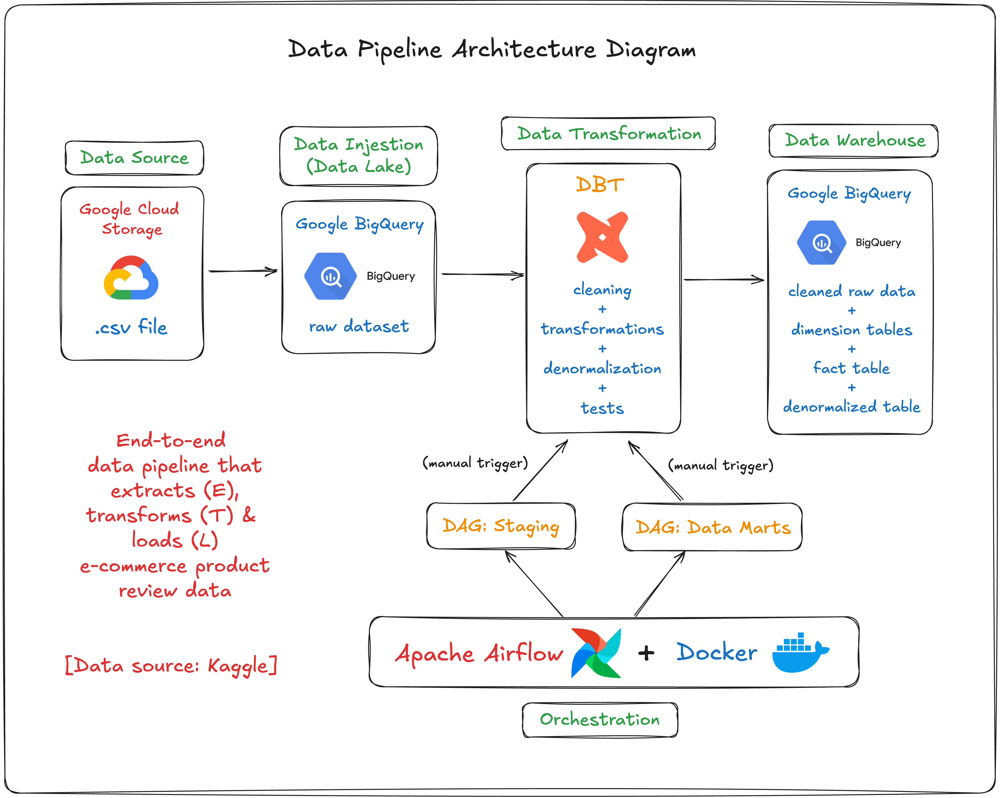
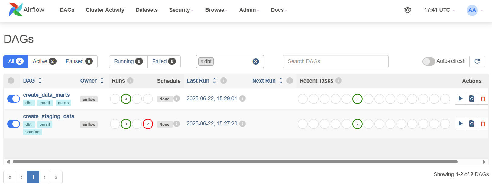
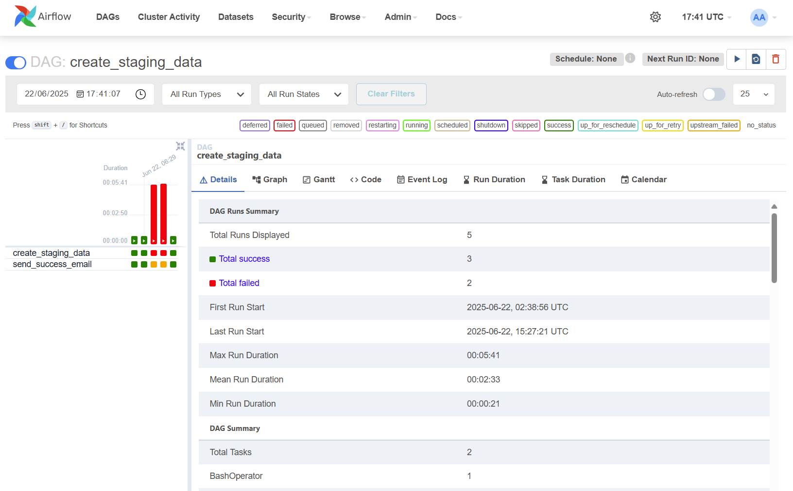
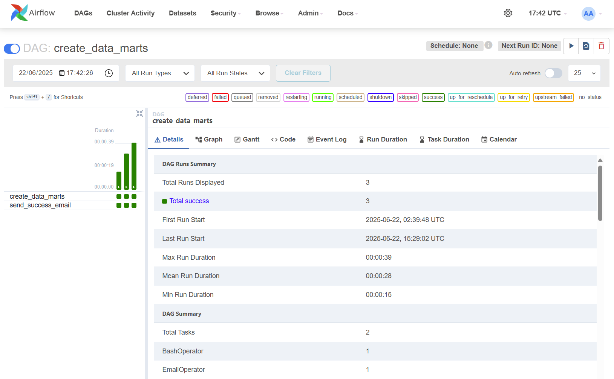
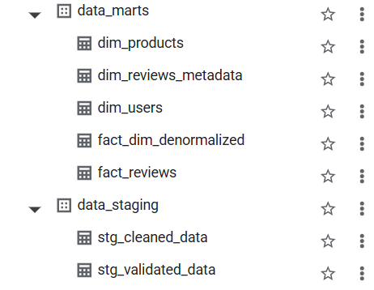

# E-commerce Data Pipeline with Airflow(Docker) & dbt

This project orchestrates an end-to-end data pipeline for an e-commerce dataset using **Apache Airflow** (in Docker) and a separate **dbt (data build tool)** project. The pipeline transforms raw source data into structured, analytics-ready datasets.

<br>

## Overview

- **Purpose:** Automate and orchestrate dbt-powered transformations for e-commerce data using Apache Airflow.
- **Architecture:**
  - Apache Airflow for orchestration
  - BashOperators to trigger dbt CLI commands
  - dbt project lives in a **[separate GitHub repo](https://github.com/nishthapant/dbt-project)**
  - Docker for containerization and local orchestration
  
<br>

## Data Pipeline Architecture Diagram



<br>

## DAGs Included

| DAG Name | Description |
|----------|-------------|
| `create_staging_data` | Triggers `dbt run` for staging models |
| `create_data_marts`   | Triggers `dbt run` for data marts     |

> NOTE: These DAGs are **manually triggered** at the moment. Future work includes adding scheduled automation.

<br>

## Email Alerts

- Configured to send email alerts upon **successful DAG completion**
- SMTP settings and recipient list can be configured via Airflow variables or environment variables

<br>

## Screenshots

### Two Airflow DAGs


### 1. DAG: `create_staging_data`


### 2. DAG: `create_data_marts`


### Data warehouse (Google BigQuery): Post ETL
<p align="center">
  
</p>

<!--  -->

<br>

## Running the Project

1. **Clone this Airflow repo**
    ```
   git clone https://github.com/nishtha-pant/airflow.git
   cd airflow
   ```

2. **Clone the dbt repo inside this folder**
   ```
   git clone https://github.com/nishtha-pant/dbt-project.git
   ```

   The dbt project should now be available at \`./dbt-project\`

3. **Start Airflow**
   ```bash
   docker-compose up --build
   ```

4. **Access Airflow UI**
   - http://localhost:8080  
   - Login: `airflow` / `airflow`

5. **Trigger DAGs**
   - `create_staging_data`
   - `create_data_marts`

<br>

## How It Works

- Each DAG uses **BashOperator** to run dbt commands inside the container:
  ```
  cd /opt/airflow/dbt-project && dbt run --select staging
  ```

- Airflow interacts with the mounted dbt project and uses the appropriate `profiles.yml` to authenticate.

<br>

## Future Enhancements

- Add DAG scheduling (daily/hourly runs)
- Add Slack alerting for failures
- Include dbt freshness checks
- Migrate to Airflow in the cloud (e.g., Cloud Composer + dbt Cloud)


